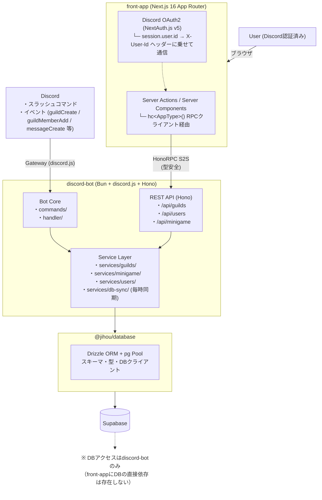

# Jihou-Bot Project

Discordサーバー向け多機能Botと管理用Webフロントエンドからなる**フルスタックモノレポ**。  
Bot本体がHono製REST APIを内包するサービスドリブンなアーキテクチャを採用し、**HonoRPCによるエンドツーエンド型安全**なNext.jsフロントエンドとのServer-to-Server通信を設計の中核に置いている。

---

## システムアーキテクチャ



---

## 設計の軸

### 1. HonoRPC によるエンドツーエンド型安全 S2S 通信

フロントエンド（Next.js Server Actions / Server Components）からBotのAPIへの通信は**HonoRPCクライアント**を使い、すべてサーバーサイドで完結する。APIルートの型定義がそのままフロントエンドに伝播するため、**手動の型定義やキャストは一切不要**。

```
ブラウザ → Next.js Server Component → hc<AppType>() → discord-bot API
                                          ↑
               APIの入出力型がTypeScriptレベルで自動共有される
               クライアントにAPIキーは一切露出しない
```

#### RPCクライアント

`front-app/src/lib/rpc-client.ts` で `hc<AppType>()` を生成し、認証ヘッダーを自動付与する。`AppType` は discord-bot の Hono アプリから export された型であり、**APIルートのリクエスト・レスポンスの型がコンパイル時に共有される**。

```typescript
// rpc-client.ts
import type { AppType } from "@jihou/shared-types";
import { hc } from "hono/client";
import { env } from "./env";
import { getAuthHeaders } from "./auth-api";

export async function createApiClient(explicitUserId?: string | null) {
  let headers: Record<string, string>;
  if (explicitUserId !== undefined) {
    headers = {
      "X-API-Key": env.API_KEY,
      "Content-Type": "application/json",
    };
    if (explicitUserId) {
      headers["X-User-Id"] = explicitUserId;
    }
  } else {
    headers = await getAuthHeaders();
  }

  const client = hc<AppType>(env.API_URL, {
    headers,
  });

  return client;
}
```

#### 型安全な呼び出しとキャッシュ制御

Server Component / Server Action から RPC クライアントを使うと、パスパラメータ・クエリパラメータ・レスポンスの型がすべて自動推論される。
また、Next.js 16 の `"use cache"` ディレクティブと `cacheLife`、`cacheTag` を用いて、関数単位で柔軟なキャッシュ制御を行っている。

キャッシュは、フロントエンドで頻繁にページ遷移すると都度リクエストが飛んでしまい、レートリミットに引っかかってしまう対策として取り入れている。

```typescript
import { cacheLife, cacheTag } from "next/cache";

// Server Component / Server Action での使用パターン
// 1. 動的情報(auth)はキャッシュ対象の外(呼び出し元)で呼ぶ
export const getUserData = async (id: string) => {
  const session = await auth();
  const callerId = session?.user?.id || "";
  return _getUserData(id, callerId);
};

// 2. 内部関数で callerId を用いてクライアントを生成し、"use cache" で関数単位のキャッシュを有効化
async function _getUserData(userId: string, callerId: string) {
  "use cache";
  cacheLife({ revalidate: 30 });
  cacheTag("user-data");

  const client = await createApiClient(callerId);
  const res = await client.api.users[":userId"].$get({
    param: { userId }, // ← パスパラメータも型チェック
    query: { includes: ["scheduledmessage"] }, // ← クエリも型チェック
  });
  if (!res.ok) throw new Error("...");
  return await res.json(); // ← 推論型: { data: { id, username, scheduledMessages_createdUserId[], ... } }
}
```

#### 認証ヘッダー

`front-app/src/lib/auth-api.ts` にAPIキーとユーザーIDを付与するヘルパーを集約し、認証情報が必要な全てのfetchがここを通る形を徹底している。

```typescript
// auth-api.ts （"use server" スコープ）
export async function getAuthHeaders(): Promise<Record<string, string>> {
  const session = await auth();

  const headers: Record<string, string> = {
    "X-API-Key": env.API_KEY,          // env.tsでパース済みの環境変数
    "Content-Type": "application/json",
  };

  if (session?.user?.id) {
    headers["X-User-Id"] = session.user.id; // 認証済みユーザーID
  }

  return headers;
}
```

### 2. APIキー + ユーザーID 二層認証

discord-bot のAPI（Hono）は、全エンドポイントに対して `apiKeyWithUserAuthMiddleware` を適用し二層の認証で保護している。

| ミドルウェア | 適用ルート | 検証内容 |
|---|---|---|
| `apiKeyWithUserAuthMiddleware` | `/*` (全APIルート) | APIキー + `X-User-Id` の一致検証 |

同ミドルウェアはURLパラメータ・リクエストボディ・クエリパラメータに含まれる `userId` と `X-User-Id` ヘッダーを照合し、**他ユーザーのデータへの横断アクセスをAPIレベルで防ぐ**。

`X-User-Id` はフロントエンドの `auth-api.ts` が NextAuth セッションから自動付与する。リクエストボディや URL パラメータも同じくフロントエンドが送信するが、Bot API 側でこれらを照合することで、万が一変造されたリクエストが届いても **認証済みユーザー以外のデータを操作できない**構造になっている。

```
# 正常リクエスト（認証済みユーザーが自分のデータにアクセス）
POST /api/users/123456789/money
  X-API-Key: xxxxxxxx   ← front-app サーバー環境変数（ブラウザに非公開）
  X-User-Id: 123456789  ← NextAuth セッション由来のDiscord ID
  → 200 OK

# 横断アクセス試行（他ユーザーのデータを操作しようとした場合）
POST /api/users/987654321/money   ← 他ユーザーのID
  X-User-Id: 123456789            ← 自分のセッションID
  → 403 Forbidden
```

### 3. 共有DBパッケージとサービス層の分離

Drizzleスキーマ・型推論・DB接続ヘルパーは `packages/database`（`@jihou/database`）に集約し、`discord-bot` から参照する。DBへの実際のアクセスはすべて `discord-bot/services/` 配下に閉じており、`api/routes/` はサービス関数を呼ぶだけで直接クエリを書かない。

```
packages/database/         ← Drizzleスキーマ・型推論・DBクライアントファクトリ
  ├─ src
  │   ├─ schema.ts         ← drizzle-kit pull で生成・テーブル定義
  │   ├─ relations.ts      ← Relational Query API 用リレーション定義
  │   ├─ index.ts    ｆ      ← テーブル・推論型・Enum を一括 export
  │   └─ client.ts         ← createDatabaseClient() ファクトリ関数
  └─ drizzle.config.ts     ← drizzle-kit 設定

discord-bot/
  └─ src
      ├─lib/db.ts         ← createDatabaseClient(env.DATABASE_URL) で接続
      └─ services/         ← この層のみが db インスタンスを使用
```

**フロントエンドはDBに一切直接アクセスしない**。`front-app` は `@jihou/shared-types` 経由で `AppType`（HonoRPC型）のみを参照する。データの読み書きはすべて discord-bot API への S2S リクエスト経由とすることで、ビジネスロジック・DBスキーマの詳細をBotサーバー内に完全に閉じ込めている。

### 4. Zod + zValidator による型安全バリデーション

`@hono/zod-validator` を活用し、Zodスキーマによるバリデーションと型推論を統合。バリデーション結果は `c.req.valid()` で型安全に取得でき、RPCクライアント側ではリクエストボディの型も自動推論される。

```typescript
// ルートハンドラでの使用例
app.post("/play",
  zValidator("json", z.object({
    bet: z.number().int().min(1),
    choice: z.enum(["heads", "tails"]),
  })),
  async (c) => {
    const { bet, choice } = c.req.valid("json"); // ← 型安全
    const result = await playCoinflip(userId, bet, choice);
    return c.json({ data: result }, 200); // ← ステータスコード明示でRPC型推論に反映
  }
);
```

バリデーション失敗時は一貫した `{ error: { code, message, details } }` フォーマットで返却する。

### 5. メモリ最適化（Fly.io 512MB対応）

512MB RAM / 1 shared CPUのデプロイ環境に合わせ、複数のレイヤーでメモリフットプリントを最小化している。

#### Drizzle ORM によるバルク同期

Prismaの`upsert()`は内部で`SELECT + INSERT/UPDATE`の2本のSQLに分解されるため、1000人のメンバー同期で最大4,000本のSQLが生成されメモリを圧迫していた。Drizzle ORM の `onConflictDoUpdate()` は PostgreSQLネイティブの `INSERT ... ON CONFLICT DO UPDATE` を**単一SQL**として生成するため、同等の処理を2本のSQL（users + guild_members）で実現できる。Prismaのバイナリエンジンも不要になり、起動時のメモリベースラインも削減された。

```typescript
// guild-sync.ts — メンバーの一括 upsert（単一SQL）
await tx
  .insert(users)
  .values(members.map((m) => ({ id: m.user.id, username: m.user.username, ... })))
  .onConflictDoUpdate({
    target: users.id,
    set: { username: sql`excluded."username"`, ... },
  });
```

#### コネクションプールの制限

```typescript
// packages/database/src/client.ts
export function createDatabaseClient(connectionString: string) {
  const pool = new Pool({
    connectionString,
    max: 3,                  // デフォルト10 → 3に削減
    idleTimeoutMillis: 10000 // アイドル接続を早期解放
  });
  const db = drizzle(pool, { schema: { ...schema, ...relations } });

  return { db, pool };
}
```

#### Bun `--smol` フラグ

Dockerfileで`bun --smol run src/start.ts`を指定し、JavaScriptCore（Bunの内部エンジン）のヒープサイズを低メモリ向けに設定。GCがより頻繁に実行され、メモリのピーク使用量を抑制する。

#### Discord.js キャッシュ制限

```typescript
makeCache: Options.cacheWithLimits({
  MessageManager: 0,          // AIハンドラはMessageオブジェクトを直接受け取るため不要
  GuildMemberManager: 200,    // LRU・サーバーごと上限200（イベント処理分のみ保持）
  UserManager: 0,
  ReactionManager: 0,
})
```

メンバーの全件同期は `guild.members.list()` のページネーション（200件/回）で実施し、各バッチをDB書き込み後に即キャッシュから追い出す設計とした。

### 6. ユーザーID単位のレート制限

`lib/rate-limiter.ts` でユーザーID × エンドポイントパスをキーとするスライディングウィンドウ型のレートリミッターを実装し、ゲーム系APIの連打・乱用を防ぐ。

```
defaultRateLimiter   → 10秒間に20リクエスト（/users, /minigame）
mutationRateLimiter  → 10秒間に15リクエスト（/guilds 書き込み系）
```

### 7. 型アサーション（`as`）の最小化

コードベース全体で `as Type` の使用を最小限に抑え、ランタイム型安全性を確保している。やむを得ず残す箇所には理由コメントを付記する方針を徹底した。

#### 環境変数の Zod バリデーション

`process.env.X as string` を排除し、起動時に Zod スキーマで一括バリデーションする `env.ts` を `front-app`・`discord-bot` 双方に導入。環境変数の設定漏れはアプリ起動時に即座に検出される。

```typescript
// lib/env.ts
const envSchema = z.object({
  DISCORD_TOKEN: z.string().min(1),
  DATABASE_URL: z.string().url(),
});
export const env = envSchema.parse(process.env);
```

#### ランタイム型ガード関数

Discord.jsのイベントペイロードやユーザー入力に対して、`as Hand` のような強制キャストの代わりに型ガード関数を使用し、無効な入力をランタイムで安全に弾く。

```typescript
function isHand(value: string): value is Hand {
  return value in HANDS;
}

const userHandStr = i.options.getString("出す手", true);
if (!isHand(userHandStr)) {
  await i.reply({ content: "無効な手が指定されました", flags: MessageFlags.Ephemeral });
  return;
}
```

#### 修正困難な箇所のコメント方針

ライブラリの型制約等により `as` を除去できない箇所には、日本語で理由を明記したコメントを残す。

```typescript
// NextAuth の JWT token 型には `id` プロパティが定義されていないため、
// module augmentation で完全に対応するには NextAuth 内部型の拡張が必要。
// 現状は `as string` で対応。
session.user.id = token.id as string;
```

---

## 技術スタック

### discord-bot

| 技術 | 用途 |
|---|---|
| **Bun** | ランタイム・パッケージマネージャ |
| **discord.js v14** | Discord Gatewayクライアント |
| **Hono v4** | REST APIフレームワーク + RPCサーバー（AppType export） |
| **hono/client** | RPCクライアント型生成（front-appと型共有） |
| **@hono/zod-validator** | Zodスキーマ統合バリデーション |
| **Drizzle ORM + pg** | ORM（`@jihou/database` 共有パッケージ経由、バイナリエンジン不要で軽量） |
| **Zod** | スキーマバリデーション |
| **node-cron** | 毎時ギルド同期・時報スケジューラ |
| **Google Gemini** (`@google/genai`) | AIチャット・おみくじ解説生成 |
| **Pino** | 構造化ロギング |
| **Biome** | Linter / Formatter |
| **Fly.io + Docker** | デプロイ先 |

### front-app

| 技術 | 用途 |
|---|---|
| **Next.js 16** (App Router) | フロントエンドフレームワーク v15からアップデート |
| **hono/client** (`hc<AppType>`) | HonoRPCクライアント（エンドツーエンド型安全） |
| **NextAuth.js v5** | Discord OAuth2認証 |
| **Tailwind CSS v4** | スタイリング |
| **shadcn/ui** | UIコンポーネントライブラリ |
| **Biome** | Linter / Formatter |

---

## 主な機能

| 機能 | 説明 |
|---|---|
| **時報** | 指定チャンネルに毎日指定時刻にメッセージ送信（node-cron） |
| **AIチャット** | Google Gemini を使ったスレッド単位の会話履歴保持チャット |
| **コインフリップ** | 所持金を賭けるミニゲーム。残高はDBで管理 |
| **おみくじ** | 1日1回制のおみくじ（AI解説生成オプション）＋ロール自動付与 |
| **じゃんけん** | 他のDiscordユーザーとの対戦型ミニゲーム |
| **ギルド同期** | 毎時バッチでチャンネル・ロール・全メンバーをDBに同期 |
| **管理フロントエンド** | スケジュールメッセージ管理・ユーザー一覧・ダッシュボード |

---

## ディレクトリ構成

```
Jihou-bot-Project/
├── discord-bot/
│   ├── src/
│   │   ├── api/
│   │   │   ├── routes/         # ルートハンドラ（バリデーション + サービス呼び出しのみ）
│   │   │   ├── schemas.ts      # 全エンドポイント共通Zodスキーマ
│   │   │   └── index.ts        # Honoアプリ + ミドルウェア構成（AppType export）
│   │   ├── commands/           # スラッシュコマンド実装
│   │   ├── handler/            # Discordイベントハンドラ・コマンドローダー
│   │   ├── services/           # ビジネスロジック + 唯一のDBアクセス層
│   │   │   ├── chat/           # Gemini AIチャットサービス
│   │   │   ├── db-sync/        # ギルド全データ同期（ページネーション）
│   │   │   ├── discord/        # Discord REST APIラッパー
│   │   │   ├── guilds/         # ギルド・時報スケジューラサービス
│   │   │   ├── minigame/       # ゲームロジック（coinflip, omikuji, janken）
│   │   │   └── users/          # ユーザーサービス
│   │   └── lib/
│   │       ├── auth.ts         # 二層認証ミドルウェア
│   │       ├── client.ts       # Discord.js クライアント（makeCache設定）
│   │       ├── db.ts           # @jihou/database 経由の Drizzle クライアント
│   │       ├── env.ts          # 環境変数Zodスキーマ
│   │       ├── rate-limiter.ts # ユーザーID単位レートリミッター
│   │       └── status-updater.ts # 毎時同期スケジューラ
│   └── Dockerfile
├── front-app/
│   └── src/
│       ├── app/                # App Router ページ
│       ├── components/         # UIコンポーネント
│       └── lib/
│           ├── rpc-client.ts   # HonoRPCクライアント（hc<AppType>生成）
│           ├── auth.ts         # NextAuth設定
│           ├── auth-api.ts     # S2S通信用認証ヘッダーヘルパー（Server専用）
│           └── env.ts          # 環境変数Zodスキーマ
└── packages/
    ├── database/               # 共有DBパッケージ（@jihou/database）
    │   ├── drizzle/            # drizzle-kit 管理ディレクトリ
    │   │   ├── meta/           # drizzle-kit スナップショット（自動生成）
    │   │   └── *.sql           # SQLマイグレーションファイル（自動生成）
    │   ├── src/
    │   │   ├── schema.ts       # Drizzleテーブル定義（drizzle-kit pull で生成・調整済み）
    │   │   ├── relations.ts    # Relational Query API 用リレーション定義
    │   │   ├── index.ts        # テーブル・推論型・Enum 一括 export
    │   │   └── client.ts       # createDatabaseClient() ファクトリ
    │   └── drizzle.config.ts   # drizzle-kit 設定
    └── shared-types/           # 共有型定義パッケージ（@jihou/shared-types）
        └── index.ts            # AppType re-export
```
